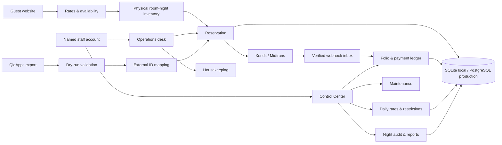

# VillaOS v1.0 — Implementation & Operations Guide

**Property:** The Taru Villas, Ubud, Bali  
**Release:** Local production-candidate  
**Document version:** 1.0  
**Prepared:** 3 August 2026  

---

## 1. Release outcome

VillaOS now replaces QloApps for the primary local reservation and property
operations workflow. The public booking engine and the staff workspace use one
database, one inventory model, and one server-side rate calculation.

This release includes:

- Individual staff accounts, encrypted passwords, revocable 12-hour sessions,
  role-based permissions, account lockout, and audit history.
- Reservation creation, modification, cancellation, no-show, check-in,
  check-out, walk-in, physical-room assignment, and housekeeping turnover.
- Daily rates, minimum stay, closed-to-arrival, closed-to-departure, and
  stop-sell restrictions.
- Folios, room charges, incidental charges, payments, refunds, balances,
  printable invoices, and revenue exports.
- Maintenance work orders that can automatically take a room out of inventory.
- Business-day records and repeat-safe night audit.
- QloApps CSV dry-run, validation, commit, external-ID mapping, reconciliation,
  shadow/pilot/primary/rollback modes.
- Database-enforced room-night inventory locks, booking idempotency, webhook
  idempotency, amount reconciliation, API rate limiting, security headers,
  local backups, a health endpoint, and business-invariant verification.
- A local SQLite profile and a generated PostgreSQL profile with an initial SQL
  migration for production rollout.

External production infrastructure is intentionally not guessed. A real
PostgreSQL service, real payment keys, a public domain, and provider webhook
configuration still require credentials owned by The Taru Villas.

---

## 2. System map



The availability counter is useful for display, but it is not the final
double-booking guard. The database also owns a unique key on each combination
of physical room and stay date. Two concurrent requests cannot own the same
room-night.

---

## 3. Local access

Keep the terminal running with:

```bash
npm run dev
```

Open these addresses on the same PC:

| Address | Purpose |
| --- | --- |
| `http://localhost:3000` | Public villa website |
| `http://localhost:3000/rooms` | Search and room selection |
| `http://localhost:3000/checkout` | Direct checkout |
| `http://localhost:3000/admin` | Front-office and housekeeping workspace |
| `http://localhost:3000/admin/control` | Commercial, financial, migration, team, and system controls |
| `http://localhost:3000/api/health` | Machine-readable health status |

The generated local owner login is stored in:

```text
outputs/VillaOS_LOCAL_LOGIN.txt
```

That file is created with owner-only file permissions. Do not send it by chat
or email. Use the owner account to create named accounts for each employee,
then keep long-term credentials in a password manager.

If the owner account ever needs to be created again and no active owner exists:

```bash
npm run admin:bootstrap
```

The bootstrap command refuses to create another owner when one is already
active.

---

## 4. Staff roles and permission boundaries

Permissions are checked on the server for every write. Changing HTML or calling
a server endpoint directly does not bypass the role.

| Role | Intended use | Main write access |
| --- | --- | --- |
| `OWNER` | System owner | All modules, team, migration, backup |
| `MANAGER` | Property leadership | Operations, rates, finance, maintenance, audit, migration, backup |
| `FRONT_DESK` | Reception | Reservations, assignment, check-in/out, housekeeping liaison, maintenance reporting |
| `HOUSEKEEPING` | Room operations | Housekeeping and maintenance reporting |
| `FINANCE` | Accounting | Folios, payments, refunds, reports, night audit, audit trail |
| `VIEWER` | Read-only management | Dashboard and reports |

Security behavior:

- Passwords use salted `scrypt`; plaintext passwords are never stored in the
  database.
- Five failed sign-ins lock the account for 15 minutes.
- Sessions are stored as SHA-256 token hashes and expire after 12 hours.
- Resetting a password revokes every existing session for that employee.
- Disabling an account also revokes its active sessions.
- The active user cannot disable their own account.
- Every operational change records actor, action, entity, timestamp, request
  context, and relevant before/after values.

### Team onboarding

1. Sign in as Owner.
2. Open **Control Center → Team**.
3. Enter the employee's real name and work email.
4. Select the least-privileged role that matches the job.
5. Create a temporary password of at least 10 characters with letters and
   numbers.
6. Deliver it through an approved private channel.
7. Disable the account immediately when the employee leaves or loses access.

---

## 5. Front-office operating procedures

### 5.1 Start of shift

1. Open `/admin` and review arrivals, departures, pending payments, occupancy,
   and housekeeping exceptions.
2. Confirm every expected arrival has a room assignment.
3. Review rooms that are Dirty, Cleaning, or Review.
4. Open **Control Center → Maintenance** and check urgent/out-of-order tickets.
5. Open **Control Center → System** and verify the health status is green.

### 5.2 Create a walk-in

1. Click **+ New booking** in the operations desk.
2. Enter guest identity and contact details.
3. Select the villa type and physical room.
4. Enter check-in, check-out, guest count, and internal note.
5. VillaOS calculates the total from stored daily rates and restrictions.
6. The reservation is only retained if every room-night can be locked.
7. Open **Control Center → Finance** to post a cash, card, transfer, or other
   manual payment.

### 5.3 Modify a reservation

1. Open **Reservations** and select the guest.
2. Expand **Modify stay & guest**.
3. Change stay dates, guest count, guest name, phone, or internal note.
4. VillaOS reprices the complete stay and attempts to re-lock the assigned
   physical room.
5. If the room is unavailable, the update is rejected and the prior stay
   remains in place.
6. Review the folio after a total change.

Only Pending Payment and Confirmed reservations can be modified through this
flow. A checked-in stay requires manager procedure and a documented adjustment.

### 5.4 Check-in

1. Confirm the reservation is Confirmed.
2. Assign a physical room if none is assigned.
3. Confirm the room has passed inspection.
4. Click **Check in**.
5. Any financial exception remains visible in the folio.

### 5.5 Check-out

1. Review folio charges, payments, refunds, and balance.
2. Settle the remaining balance or record the approved exception.
3. Click **Check out**.
4. VillaOS marks the room Dirty and creates a high-priority turnover task.
5. Housekeeping progresses the task: Open → In Progress → Done → Inspected.

### 5.6 Cancellation and no-show

- Cancellation is allowed for Pending Payment or Confirmed reservations.
- No-show is allowed for Confirmed reservations.
- Both states release future room-night locks immediately.
- Refund money movement is recorded separately in the folio; changing a
  reservation status never silently creates a refund.

---

## 6. Rates and restrictions

The active public rate plan is `BAR` (Best Available Rate). A villa's base rate
is the fallback. A Daily Rate overrides it for one date.

Open **Control Center → Rates** to set:

- Price in IDR.
- Minimum stay.
- Stop sell.
- Closed to arrival (CTA).
- Closed to departure (CTD).

Booking totals are always recomputed on the server from the rate for every stay
date. Browser-provided totals are ignored. Availability returns the restriction
reason when a stay cannot be sold.

Recommended control:

- Front Desk: read only.
- Revenue/Manager: rate write permission.
- Owner: weekly review of overrides and stop-sell dates.

---

## 7. Folios, payments, refunds, and invoices

Each reservation owns one folio. The accounting convention is:

- Charges are debits.
- Payments are credits.
- Refunds reverse a prior credit and therefore create a debit.
- Balance due = total debits − total credits.

### Post an incidental charge

1. Open **Control Center → Finance**.
2. Select the guest folio.
3. Enter a clear description such as `Airport transfer` or `Minibar`.
4. Enter the amount and click **Add charge**.

### Record a manual payment

1. Select Cash, Bank Transfer, Card, or Other.
2. Enter the amount actually received.
3. Post the payment.
4. A full payment on a Pending Payment reservation confirms it.

### Record a refund

1. Enter a specific approved reason.
2. Enter the amount.
3. Click **Record refund**.
4. Complete the actual money transfer in the source payment channel.

The refund entry is a ledger record; it does not invent a provider API refund
without credentials and approval.

### Invoice

Click **Open printable invoice** on a folio. Use the browser's Print / Save PDF
control. The invoice includes guest details, stay, villa/unit, line items,
payments, credits, and balance.

### CSV exports

- Reservations: `/api/admin/reports/reservations.csv`
- Revenue: `/api/admin/reports/revenue.csv`

Both endpoints require a valid staff session and report permission.

---

## 8. Maintenance and out-of-order rooms

1. Open **Control Center → Maintenance**.
2. Select a physical room.
3. Enter the issue, description, priority, and assignment.
4. Select **Take room out of order** when the issue makes the room unsafe or
   unsellable.
5. Progress the ticket through Open → In Progress → Resolved → Closed.

When a blocking ticket is created, the room becomes `OUT_OF_ORDER`. Resolving
or closing the ticket returns it to `SELLABLE` only when no other active
blocking ticket exists for that room.

Existing reservations are not silently moved. A manager must review affected
assignments and relocate guests explicitly.

---

## 9. Night audit

Open **Control Center → Night Audit** at the end of the operational day.

The audit records:

- Occupied room-nights and sellable rooms.
- Occupancy percentage.
- Successful payment revenue for the day.
- Pending arrivals.
- Departures still Confirmed or Checked In.
- Open high-priority maintenance.

It then closes the selected Business Day and opens the next date. Running the
same date twice is rejected. Operational exceptions are preserved in the
snapshot instead of being hidden.

Recommended sequence:

1. Resolve or explain pending arrivals.
2. Resolve or explain open departures.
3. Review high-priority maintenance.
4. Reconcile payments against provider dashboards.
5. Run night audit.
6. Export the required management report.

---

## 10. QloApps migration

### 10.1 Import contract

Use the downloadable template:

```text
http://localhost:3000/templates/qloapps-bookings-import.csv
```

Columns:

| Column | Required | Notes |
| --- | --- | --- |
| `qlo_booking_id` | Yes | Stable QloApps booking ID; idempotency key for migration |
| `booking_code` | Recommended | Original reference; VillaOS resolves a duplicate code safely |
| `villa_slug` | Yes | `taru-garden-villa`, `taru-river-villa`, or `taru-sky-estate` |
| `room_code` | Optional | Physical room such as `G-01`; auto-assigned when blank |
| `check_in` | Yes | `YYYY-MM-DD` |
| `check_out` | Yes | `YYYY-MM-DD`, later than check-in |
| `guest_name` | Yes | Guest display name |
| `email` | Recommended | Placeholder is created only when missing |
| `phone` | Recommended | `MISSING` is used only when absent |
| `guests` | Yes | Positive whole number; capped at villa capacity on commit |
| `total_amount` | Recommended | IDR integer; fallback uses base rate |
| `status` | Yes | pending, confirmed, checked_in, checked_out, cancelled, no_show, expired |
| `source` | Optional | Defaults to QloApps import |
| `payment_ref` | Optional | Original transaction reference |

### 10.2 Dry-run

1. Export and normalize QloApps data into the template.
2. Open **Control Center → Migration**.
3. Upload the CSV, maximum 5 MB.
4. VillaOS validates every row and stores the batch without creating bookings.
5. Any invalid row makes the batch non-committable.
6. Correct the source CSV and upload a new batch.

### 10.3 Commit

Commit only a zero-error batch. For every row VillaOS:

1. Checks whether the external QloApps ID is already mapped.
2. Creates the local reservation.
3. Locks all physical room-nights for active statuses.
4. Creates the folio and room charge.
5. Stores the QloApps-to-VillaOS ID mapping and payload checksum.

An already mapped ID is skipped. A room conflict is retained as an exception
instead of silently overbooking.

### 10.4 Reconciliation

For every batch compare:

- Source row count.
- Valid and invalid rows.
- Imported, skipped, and conflict rows.
- Reservation status totals.
- Arrival and departure counts for the pilot window.
- Total reservation value and collected payment value.
- Physical room assignments.

Keep the original QloApps export and the VillaOS batch result together as the
migration evidence package.

---

## 11. Pilot, cutover, and rollback

### Modes

| Mode | Meaning |
| --- | --- |
| `SHADOW` | QloApps remains the comparison source; VillaOS is reconciled daily |
| `VILLAOS_PRIMARY` | VillaOS is the operational source of truth |
| `QLOAPPS_ROLLBACK` | Staff return to QloApps under the rollback procedure |

Pilot statuses are `NOT_STARTED`, `PILOT`, `READY`, `COMPLETED`, and
`ROLLED_BACK`.

### Recommended 7–14 day pilot

1. Create named staff accounts and finish role training.
2. Take and verify a local backup.
3. Run QloApps dry-run and clear every validation error.
4. Commit an agreed pilot data set.
5. Set pilot status to `PILOT`; keep migration mode `SHADOW`.
6. Reconcile arrivals, departures, room nights, balances, and payments daily.
7. Log every exception and resolution.
8. Run night audit daily in VillaOS.
9. Confirm payment webhooks in provider sandbox.
10. Test one restore drill on a non-production copy.
11. Obtain Owner/Manager/Finance sign-off.
12. Set pilot status to `READY`.
13. At the agreed cutover time, take a final backup and final QloApps export.
14. Complete the final delta import and reconciliation.
15. Set QloApps to read-only where operationally possible.
16. Set migration mode to `VILLAOS_PRIMARY` and pilot status to `COMPLETED`.

### Rollback triggers

- Unreconciled room-night inventory difference.
- Confirmed double allocation.
- Payment webhook failures that cannot be replayed safely.
- Data corruption or unavailable database without an acceptable recovery time.
- Critical staff workflow blockage during the cutover window.

### Rollback procedure

1. Stop new direct bookings or place affected dates on stop-sell.
2. Record the incident time and responsible decision maker.
3. Take a VillaOS backup before changing anything.
4. Export the VillaOS delta since the final QloApps sync.
5. Set `migration.mode` to `QLOAPPS_ROLLBACK` and pilot status to
   `ROLLED_BACK`.
6. Re-enter or import the delta into QloApps under dual verification.
7. Confirm arrivals, departures, rooms, balances, and payment references.
8. Announce the system of record to every shift.
9. Keep VillaOS data read-only for incident analysis.

Changing the displayed mode does not automatically mutate QloApps. It is a
controlled operational decision and audit marker.

---

## 12. Backup and restore

### Create a backup

Open **Control Center → System → Run verified backup**.

The same operation is available for scheduled local jobs:

```bash
npm run backup
```

VillaOS copies the local SQLite database to `backups/`, records file size, and
stores a SHA-256 checksum in the database. The source database is not modified.

Backups are ignored by Git. Copy approved backups to encrypted external storage
according to the property's retention policy.

Suggested retention:

- Hourly or per-shift: last 24 copies.
- Daily: 30 days.
- Monthly: 12 months.
- Pre-migration/pre-cutover: retain with the migration evidence package.

### Local restore procedure

Restoring overwrites live state. Perform it only with Owner approval.

1. Stop `npm run dev`.
2. Copy the current `prisma/dev.db` to a separately named safety file.
3. Verify the chosen backup filename, size, timestamp, and checksum.
4. Copy the chosen backup over `prisma/dev.db`.
5. Start VillaOS.
6. Run `npm run verify`.
7. Check `/api/health`, today's reservations, room board, folios, and audit log.
8. Record the restore decision and reconciliation result.

Do not delete the pre-restore safety copy until the restored database is signed
off.

PostgreSQL production backups must use provider point-in-time recovery plus a
documented restore drill. The local file button is intentionally disabled for a
non-file `DATABASE_URL`.

---

## 13. PostgreSQL production rollout

VillaOS detects PostgreSQL when `DATABASE_URL` begins with `postgres://` or
`postgresql://`. The post-install script generates the matching Prisma Client.

Prepared files:

```text
prisma/postgresql/schema.prisma
prisma/postgresql/migrations/0001_initial/migration.sql
```

### Procedure

1. Provision PostgreSQL with automated backups and TLS.
2. Create a least-privileged application database user.
3. Set the production environment variables, including:

   ```text
   DATABASE_URL=postgresql://...
   NEXT_PUBLIC_APP_URL=https://your-domain
   PMS_BACKEND=local
   PAYMENT_PROVIDER=xendit or midtrans
   ADMIN_EMAIL=owner work email
   ADMIN_KEY=one-time strong bootstrap password
   SEED_DEMO_DATA=false
   ```

4. Install dependencies. Post-install will select the PostgreSQL profile.
5. Run:

   ```bash
   npm run db:postgres:migrate
   npm run db:postgres:seed
   npm run verify
   npm run build
   ```

6. Remove `ADMIN_KEY` from the long-running production runtime after the first
   successful seed if seed reruns must not rotate the owner password.
7. Configure provider webhooks over HTTPS.
8. Confirm `/api/health` and authenticated reports.
9. Run migration dry-run, sandbox payment, backup, and restore drills.
10. Begin the shadow pilot.

Do not point a serverless deployment at SQLite. SQLite is the local-PC profile.

---

## 14. Payment and webhook controls

### Direct booking controls

- Totals are computed from stored rates.
- Guest capacity is checked on the server.
- Ten booking attempts per IP per 15 minutes are allowed in the local process.
- An `Idempotency-Key` header can protect client retries.
- A reservation is retained only after physical room-nights are locked.
- Unpaid holds expire after 60 minutes and release inventory.

### Webhook controls

- Midtrans signatures and Xendit callback tokens are verified.
- Unsigned mock webhooks are rejected in production.
- Provider event ID and payload hash are stored.
- Reusing an event ID with different payload data is rejected.
- Successful duplicate events are acknowledged without posting money twice.
- Paid amount must equal the reservation total.
- A late payment for an expired/cancelled stay is not silently confirmed.
- Successful payments create both a payment transaction and folio credit.

Provider setup still requires real credentials and HTTPS callback URLs.

---

## 15. Health, monitoring, and incident response

`GET /api/health` returns:

- Service status.
- Database reachability.
- Migration operating mode.
- Check timestamp and latency.

It does not return credentials or raw database errors.

Recommended production alerts:

- Health endpoint unavailable or HTTP 503.
- Webhook events in Failed state.
- Backup failure or no successful backup inside the retention objective.
- Night audit not completed by the agreed cut-off.
- Out-of-order room count above threshold.
- Pending payments older than the hold window.
- PostgreSQL storage, connection, or replication alerts.

### Incident first response

1. Do not edit database rows manually.
2. Capture time, affected booking codes, staff user, and provider references.
3. Check health, audit trail, webhook event, reservation, inventory nights, and
   folio.
4. Prevent new sales on affected inventory if double-selling is possible.
5. Take a backup.
6. Reconcile before applying a correction.
7. Record the correction through an auditable VillaOS action where possible.
8. Invoke rollback only under the documented triggers.

---

## 16. Validation commands

Run before a release or cutover:

```bash
npm run lint
npm run build
npm run verify
```

`npm run verify` checks:

- An active Owner account exists.
- Physical room totals match configured villa totals.
- Every active booking owns the expected number of room-nights.
- Folio accommodation charges match reservation totals.
- Required operational settings exist.

Manual checks:

1. `/api/health` returns HTTP 200.
2. `/admin` shows the staff sign-in page.
3. `/admin/control` redirects to sign-in without a valid session.
4. Availability returns VillaOS as backend and current stored rates.
5. Create and cancel a test booking; verify room-night release.
6. Post a test payment twice with the same provider event; verify one ledger
   credit.
7. Run a QloApps dry-run with one valid and one invalid row.
8. Verify CSV exports require sign-in.
9. Create, verify, and retain a backup.

---

## 17. Environment variable reference

| Variable | Purpose |
| --- | --- |
| `DATABASE_URL` | SQLite file URL locally; PostgreSQL URL in production |
| `NEXT_PUBLIC_APP_URL` | Canonical public origin and payment return URL |
| `ADMIN_EMAIL` | Bootstrap Owner email |
| `ADMIN_NAME` | Bootstrap Owner display name |
| `ADMIN_KEY` | Bootstrap Owner password; hashed during seed |
| `SEED_DEMO_DATA` | `true` locally; `false` for clean production seed |
| `PMS_BACKEND` | `local` for VillaOS; `qloapps` for legacy rollback compatibility |
| `PAYMENT_PROVIDER` | `mock`, `midtrans`, or `xendit` |
| `MIDTRANS_SERVER_KEY` | Midtrans server credential |
| `MIDTRANS_CLIENT_KEY` | Midtrans client credential |
| `MIDTRANS_IS_PRODUCTION` | Selects sandbox or production endpoint |
| `XENDIT_SECRET_KEY` | Xendit API credential |
| `XENDIT_CALLBACK_TOKEN` | Xendit Invoice webhook verification |
| `XENDIT_WEBHOOK_TOKEN` | Xendit Payment Request webhook verification |
| `QLOAPPS_API_URL` | Legacy QloApps host |
| `QLOAPPS_API_KEY` | Legacy QloApps webservice credential |

Never commit `.env`, credentials, backup files, or the local login file.

---

## 18. Release boundaries and owner decisions

The application is complete as a local production-candidate for the roadmap
implemented in this release. These external actions are intentionally pending:

1. Select and provision the production PostgreSQL provider.
2. Select the hosting/domain/TLS environment.
3. Provide live Xendit or Midtrans credentials and configure provider webhooks.
4. Provide the authoritative QloApps export and approve its mappings.
5. Define taxes, service charge, invoice legal identity, and refund authority.
6. Approve named staff and their roles.
7. Execute the 7–14 day pilot and sign the cutover decision.
8. Replace demo villa photography and contact information with approved assets.

Until those decisions are completed, keep VillaOS on the local PC in Shadow
mode and do not present it as a live public payment system.

---

## 19. Quick handover checklist

- [ ] Owner login stored privately.
- [ ] Named staff accounts created.
- [ ] Roles reviewed by manager.
- [ ] Demo data distinguished from operational data.
- [ ] Rates and restrictions reviewed.
- [ ] Invoice identity and taxes approved.
- [ ] Payment sandbox test passed.
- [ ] QloApps dry-run has zero invalid rows.
- [ ] QloApps reconciliation signed.
- [ ] Backup and restore drill passed.
- [ ] Night audit drill passed.
- [ ] Health monitoring connected.
- [ ] Pilot started in Shadow mode.
- [ ] Cutover and rollback owners named.
- [ ] Production PostgreSQL and HTTPS configured.

**End of guide.**
